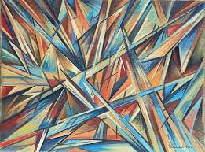
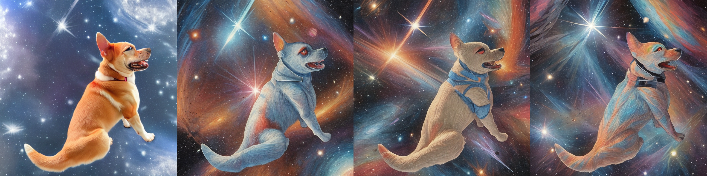
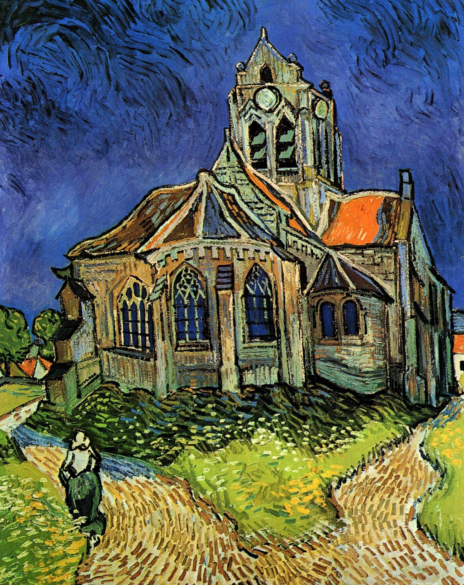
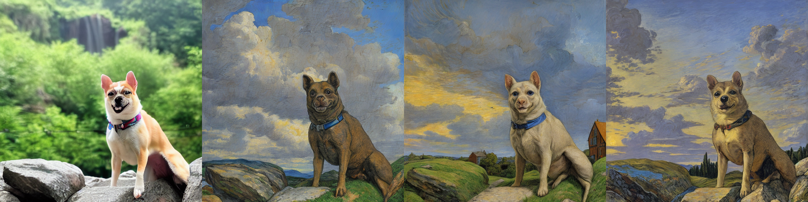

# Subject & Style Transfer using Diffusion Models

### Problem Statement

Implement a pipeline that can take both a set of subject images and a different set of style images for generating new images. For instance, "A picture of <subject> riding a horse on the moon, in the style of <style>". It is not required to following the prompting format from the examples provided here, i.e., the task does not have to be solved with a single prompt/model evaluation. Prompt following capabilities should be preserved as much as possible while incorporating subject and style. Feel free to be creative and incorporate your own ideas.


## Instructions

(Since it is a build-up on Task 1's dreambooth fine-tuning, the inital instructions are same)

1. Create virtual environment and install required packages from requirements.txt

2. Generate class images

```
bash scripts/generate_class_images.sh
```

Then copy it to the root directory.

3. Run Dreambooth LoRA fine-tuning with images of my pet dog.

```
bash scripts/run_dreambooth_lora.sh > dreambooth_ft_lora.log 2>&1
```

4. For inference, two things are required: a prompt and a reference style image


## Results

\<vobj> : Dali (my pet dog)

1. Prompt: "A photo of \<vobj> in space"

Reference Style Image: 


(the first image is the output of Stage 1 (text-to-image), the other 3 are the output images of that image in the reference art style)

Subject and Style transferred image:



2. Prompt: "A photo of \<vobj> in a natural setting, waterfall in the background"

Reference Style Image: 



Subject and Style transferred image:


